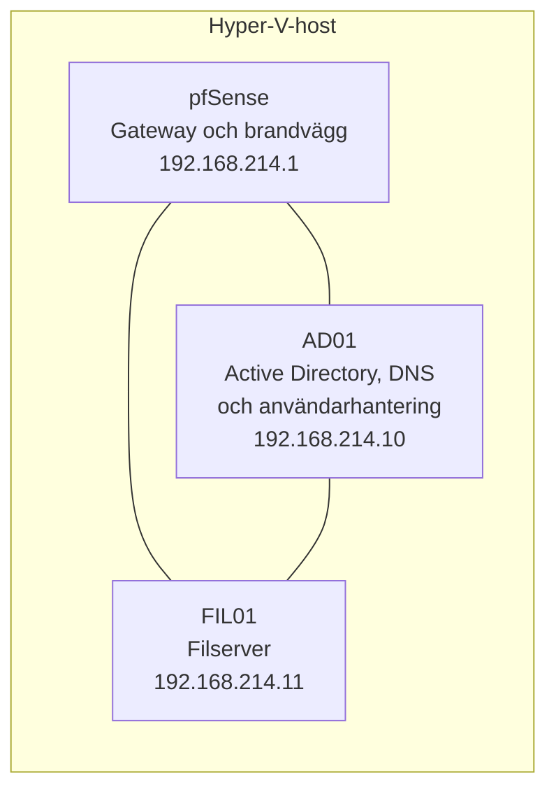
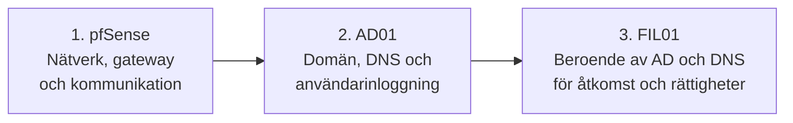
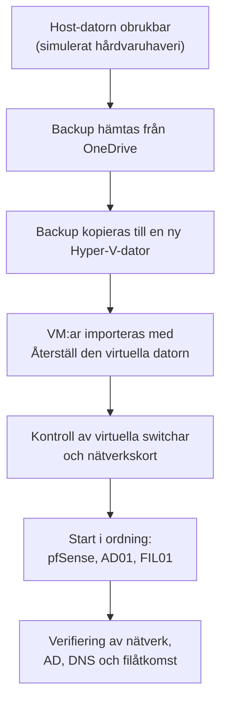

# Disaster Recovery Plan – backup och återställning av en Hyper-V-miljö

En katastrofåterställningsplan för en IT-miljö med brandvägg, domänkontrollant och filserver. Planen täcker backup enligt 3-2-1-principen, återställning i rätt ordning och verifiering, och testades både genom en simulerad krasch och genom att flytta hela miljön till en annan fysisk dator.

projekt inom utbildningen Moln- och virtualiseringsspecialist, Campus Mölndal.

**Teknik:** Hyper-V · pfSense · Windows Server · Active Directory · Windows Server Backup · PowerShell · Robocopy · OneDrive

---

## Syfte

Att kunna återställa hela miljön vid ett större haveri, till exempel ransomware, borttagna virtuella maskiner, felaktig konfiguration eller hårdvarufel, och säkerställa att nätverk, Active Directory och filåtkomst fungerar efteråt.

## Miljö

## Backupstrategi

Strategin bygger på **3-2-1-principen**: tre kopior av viktig data, på två olika lagringsmedier, varav en kopia utanför den lokala miljön. Flera kompletterande metoder används, så att det finns alternativ om en metod inte fungerar eller tar för lång tid.

| Vad | Metod | Sparas på |
|---|---|---|
| Hela VM:ar (pfSense, AD01, FIL01) | Export från Hyper-V med PowerShell | USB-disk, host-dator och OneDrive |
| pfSense-konfiguration | Krypterad XML-fil via webGUI | Backupmappen, tillsammans med VM-exporten |
| AD01 | System State-backup med Windows Server Backup | Backupdisken |
| Filserverns delade data | Robocopy | USB-disk, host-dator och OneDrive |

### Export av virtuella maskiner
Varje VM exporterades från Hyper-V, vilket ger en komplett backup med både konfiguration och virtuella hårddiskar. Se [`scripts/01-export-vm.ps1`](scripts/01-export-vm.ps1).

### Backup av pfSense-konfigurationen
Utöver hela VM:n togs en separat backup av konfigurationen via **Diagnostics > Backup & Restore** i webGUI:t. XML-filen innehåller bland annat interface-inställningar, LAN/WAN, brandväggsregler, NAT, DHCP, DNS och VPN.

Filen krypterades med pfSense inbyggda kryptering, eftersom den kan innehålla känslig information. Krypteringslösenordet sparades på flera platser så att alla i gruppen kan komma åt det, eftersom filen inte går att återställa utan det.

### System State-backup av AD01
AD01 hanterar domänen, DNS och användarkonton, och fick därför en extra backup med Windows Server Backup. Den gör att servern kan återställas även vid problem med operativsystemet eller systemfilerna. Se [`scripts/02-systemstate-backup.ps1`](scripts/02-systemstate-backup.ps1).

### Filbackup med Robocopy
Filserverns delade mappar kopierades med Robocopy, inklusive NTFS-behörigheter och ägarskap. Se [`scripts/03-robocopy-shared.ps1`](scripts/03-robocopy-shared.ps1).

## Återställningsordning

Servrarna är beroende av varandra och måste därför återställas i rätt ordning.

Vid import i Hyper-V valdes **Återställ den virtuella datorn**, så att VM:arna behåller samma VM-ID. Det passar när målet är att återställa samma miljö, inte att skapa en kopia eller klon.

## Test av återställning

Efter backupen simulerades en krasch, och alla tre servrar återställdes. Hela övningen, från förberedelse av backup till lyckad återställning, tog **1 timme och 15 minuter**. Därefter verifierades miljön under 15 minuter.

**Kontroller efter återställning**
- [x] pfSense, AD01 och FIL01 startade korrekt
- [x] Nätverket fungerade och IP-adresserna var korrekta
- [x] AD-miljön fungerade
- [x] Filservern hade kvar sina filer, och inga filer saknades

Kontrollerna gjordes med `Test-Connection`, `nslookup`, `Test-Path` och `dcdiag`. Se [`scripts/04-verify-restore.ps1`](scripts/04-verify-restore.ps1).

### Återställning av pfSense från XML
Som ett separat test installerades en helt ny pfSense-VM, och konfigurationen återställdes från XML-filen via **Diagnostics > Backup & Restore > Restore Configuration**. Det visar att brandväggen kan byggas upp igen även om den ursprungliga VM:n försvinner helt.

## Challenge – återställning till en annan fysisk dator

Syftet var att testa om miljön går att återställa även om själva Hyper-V-hosten kraschar. En backup är inte fullt användbar om den bara fungerar på maskinen där den skapades.

**Krav på den nya datorn:** Hyper-V installerat, tillräckligt diskutrymme, samma virtuella switchar och tillgång till backupfilerna.

**Nätverkskontroll efter flytten:** virtuella switchar kan skilja sig mellan olika hostar. Om nätverkskort eller switchar inte stämmer kan servrarna starta men ändå inte kommunicera. Därför kontrollerades att pfSense hade rätt nätverkskort på rätt switch, att AD01 och FIL01 låg på rätt LAN-switch och att IP-adresserna var desamma som innan.

**Verifiering**
- [x] pfSense: rätt LAN-IP, webGUI nåbart, nätverket fungerade mellan servrarna
- [x] AD01: Active Directory och DNS fungerade, användare som importerats via CSV fanns kvar
- [x] FIL01: delade mappar och filer fanns kvar, åtkomst till shares fungerade

**Resultat:** återställningen till en annan dator lyckades. Backupen var inte beroende av den ursprungliga hosten, vilket innebär att miljön kan återställas även om den fysiska servern kraschar helt.

## Resultat

- Alla VM:ar kunde återställas
- pfSense-konfigurationen kunde återställas via XML-fil på en ny installation
- AD01 och FIL01 fungerade efter återställning
- Filserverns data fanns kvar, och inga filer saknades
- Backupen fanns på flera platser enligt 3-2-1-principen
- Miljön kunde återställas även på en annan fysisk dator

## Skript

| Fil | Körs på | Syfte |
|---|---|---|
| [`01-export-vm.ps1`](scripts/01-export-vm.ps1) | Hyper-V-hosten | Exporterar alla VM:ar |
| [`02-systemstate-backup.ps1`](scripts/02-systemstate-backup.ps1) | AD01 | System State-backup med Windows Server Backup |
| [`03-robocopy-shared.ps1`](scripts/03-robocopy-shared.ps1) | FIL01 | Kopierar delade filer med behörigheter |
| [`04-verify-restore.ps1`](scripts/04-verify-restore.ps1) | AD01 | Verifierar nätverk, DNS, filåtkomst och AD |

## Vad jag lärde mig

## Vad jag lärde mig

- Den viktigaste lärdomen är att en backup bara är värd något om man har testat
att återställa den. Det var först när vi faktiskt kraschade miljön och byggde
upp den igen som vi visste att planen fungerade.

- Jag lärde mig också hur mycket ordningen spelar roll. Servrarna är beroende av
varandra, så filservern fungerar inte förrän AD och DNS är uppe, och ingenting
kommunicerar utan brandväggen. Att tänka igenom beroendena innan man börjar
återställa sparar mycket tid när något väl har gått fel.

- Challenge-testet visade att en backup måste fungera även på ny hårdvara.
Där lärde jag mig att virtuella switchar och nätverkskort kan skilja sig mellan
olika hostar, och att servrarna kan starta utan att kunna prata med varandra om
nätverket inte är rätt kopplat.

- Att använda flera metoder parallellt, som VM-export, XML-backup av pfSense,
System State-backup och Robocopy, gav oss flera vägar tillbaka om en metod
skulle strula. Jag lärde mig också att krypterade backuper kräver en plan för
lösenordet, annars går de inte att använda när man väl behöver dem.
